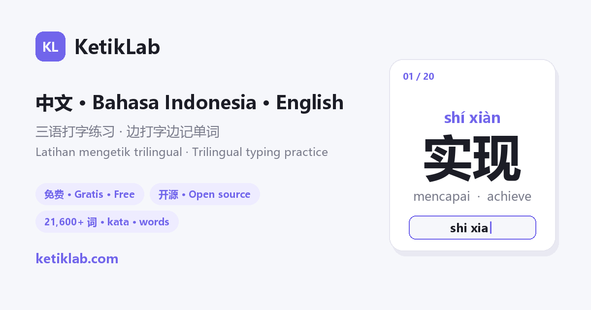

# KetikLab

**Free, open-source typing and vocabulary practice. Learn Chinese, English or Indonesian, with meanings in the language you know best.**
Type words and classic readings; the site teaches you the vocabulary while you type.

🌐 **https://ketiklab.com** · [中文](https://ketiklab.com/zh/) · [Bahasa Indonesia](https://ketiklab.com/id/) · [English](https://ketiklab.com/en/)

[](https://github.com/susilisma/ketiklab/actions/workflows/site.yml)



## What is in it

Counts as of 2026-09-15. New words are generated in batches, reviewed by hand, and released by the hourly job (see *Content pipeline* below).

| | |
|---|---|
| Words by Topic | **3,700+** words in four topics: daily, study & policy, business, life in Indonesia |
| Meanings | One meaning line per word, in the language you pick: Chinese, Indonesian or English, or none for typing only. An English definition or the other languages are opt-in extras, and meanings can be hidden until you peek |
| Exam libraries | **10 lists, nearly 18,000 words** (21,700+ across the site together with Words by Topic) — English core / intermediate / advanced / academic (by Zipf frequency band), Business English and a TOEFL list; Chinese core / intermediate / advanced; an Indonesian frequency list |
| Classic readings | **160** public-domain texts in Chinese, Indonesian or English, typed line by line |
| Chinese ladder | 认读 (read, pinyin printed **above** the character) → 打拼音 (type the pinyin) → 选汉字 (pick the character) → 输入法 (type it with your IME) |
| Memory | Spaced repetition on a 1 / 2 / 4 / 7 / 15 / 30 / 60 / 120-day ladder, a mistakes book, favourites, a learning calendar |
| Account | Optional; progress lives in the browser. Stats, calendar, favourites, chapters and settings can be synced through an account; the review schedule travels by export / import |
| Platform | A PWA: runs in any modern browser, installs to the home screen, works offline for the parts you have opened |

**Who it is for:** Indonesians learning Chinese or English; Chinese speakers learning Indonesian; anyone who wants typing practice in Chinese, Indonesian or English.

**What it is not:** there is no app in the stores, no AI tutor, no live classes, and no ads.

Data sources and licences for every library are listed in [public/data/SOURCES.md](public/data/SOURCES.md).

---

## 中文

**免费开源的打字背单词网站。学中文、印尼语或英语，释义用你最熟悉的语言。** 一边打字，一边把词记住。

- **3,700+** 个主题词汇，分日常、学习与政策、商务、印尼生活四类
- 每个词只显示一行释义，语言由你选：中文、印尼语或英语，也可以不显示释义、只练打字；英文定义或其他语言是可选的附加行，释义也可以先隐藏、需要时再看
- **10 个考试词库，近 18,000 词**（连同主题词汇，全站 21,700+ 词）：英语核心 / 进阶 / 高阶 / 学术（按 Zipf 词频分档）、商务英语与托福词表；中文核心 / 进阶 / 高阶；印尼语高频词
- **160** 篇公共领域经典朗读，逐句照着输入
- 中文四步阶梯：**认读**（拼音印在汉字上方）→ **打拼音** → **选汉字** → **输入法**
- 艾宾浩斯间隔复习（1/2/4/7/15/30/60/120 天）、错词本、收藏、学习日历
- 进度存在浏览器里，可导出导入；账号与云同步为可选
- PWA：浏览器打开即用，可安装到手机，打开过的内容可离线使用

适合：学中文或英语的印尼人、学印尼语的中文使用者，以及想练中文、印尼语或英语打字的人。没有应用商店版本、没有 AI 老师、没有直播课、没有广告。

各词库的来源与授权见 [public/data/SOURCES.md](public/data/SOURCES.md)。

---

## Bahasa Indonesia

**Latihan mengetik dan kosakata gratis dan open source. Belajar Mandarin, Inggris, atau Indonesia — artinya dalam bahasa yang paling kamu pahami.** Sambil mengetik, kata-katanya ikut hafal.

- **3.700+** kata Kosakata Tematik dalam empat tema: harian, belajar & kebijakan, bisnis, hidup di Indonesia
- Satu baris arti per kata, dalam bahasa pilihanmu: Mandarin, Indonesia, atau Inggris, atau tanpa arti untuk latihan mengetik saja. Definisi Inggris atau bahasa lain bisa ditambahkan, dan arti bisa disembunyikan sampai kamu mengintip
- **10 kamus ujian, hampir 18.000 kata** (lebih dari 21.700 kata di seluruh situs): Inggris inti / lanjutan / tingkat atas / akademik (per pita frekuensi Zipf), Inggris bisnis, dan daftar TOEFL; Mandarin inti / lanjutan / tingkat atas; daftar frekuensi bahasa Indonesia
- **160** bacaan klasik domain publik, diketik baris demi baris
- Tangga Mandarin empat langkah: **baca** (pinyin di atas hanzi) → **ketik pinyin** → **pilih hanzi** → **ketik dengan IME**
- Pengulangan berjarak (1/2/4/7/15/30/60/120 hari), buku kesalahan, favorit, kalender belajar
- Progres tersimpan di browser dan bisa diekspor/diimpor; akun dan sinkronisasi cloud bersifat opsional
- PWA: langsung di browser, bisa dipasang di HP, bagian yang pernah dibuka bisa dipakai offline

Untuk: orang Indonesia yang belajar Mandarin atau Inggris, penutur Mandarin yang belajar bahasa Indonesia, dan siapa pun yang ingin latihan mengetik dalam bahasa Mandarin, Indonesia, atau Inggris. Tidak ada aplikasi di toko aplikasi, tidak ada tutor AI, tidak ada kelas langsung, tidak ada iklan.

Sumber dan lisensi tiap kamus ada di [public/data/SOURCES.md](public/data/SOURCES.md).

---

## Development

Vite + React 19 + TypeScript, plain CSS, no backend: a static site on GitHub Pages. Content is JSON under `public/data/`, fetched at runtime, so the bundle does not grow with the library.

```bash
npm install
npm run dev      # local preview
npm run build    # dist/
```

### 部署
GitHub Actions（`.github/workflows/site.yml`）在每次 push 到 `main` 时构建并发布到 GitHub Pages；首次需在仓库 Settings → Pages → Source 选 **GitHub Actions**。构建后 `scripts/build-seo-pages.py` 会生成 `/zh/`、`/id/`、`/en/` 三个语言落地页、每个词库一页静态词表、朗读列表页和完整的 `sitemap.xml`。

### 数据架构（参考 qwerty-learner）
内容不打包进代码，放在 JSON 文件里、运行时由前端 `fetch` 加载：
- 主题词汇（内部 id 仍为 `trio`）：`public/data/words.json`（`Word` 对象数组）
- 考试词库：`public/data/manifest.json` 登记，各词库 `public/data/<id>.json` 按需加载
- 朗读：`public/data/readings.json`（公共领域全文，带作者 / 年代 / 来源 / 授权）
- 拼音与分级：`public/data/zh-pinyin.json`

### 间隔复习（艾宾浩斯 / IndexedDB）
`src/srs.ts` 用 Dexie 在浏览器 IndexedDB 记录每个词的复习状态：答对沿 1/2/4/7/15/30/60/120 天间隔阶梯上升，答错回到起点并很快重现；到期前答对不提前升级。"间隔复习"页显示今日待复习 / 已掌握 / 学习中，可一键复习到期词。

### 内容规则
词汇须中 - 印 - 英语义对齐（非表面直译），优先日常 / 商务 / 印尼生活与公共服务 / 公共政策 / 学术研究。朗读只用公共领域或开放授权全文，逐条记录作者、年代、来源、授权。界面支持三种语言但不混排；释义只显示用户选的一种。

### Content pipeline
- 追加工具：`node scripts/append-batch.mjs [--dry-run] <batch.json>` — 词条支持元组 `[en,id,zh,category,level?]` 或完整对象；自动 schema 校验 + 去重（词按 en/id/zh；朗读按 id 与 title+author）+ 幂等。例句只保留提交时给出的，不再自动生成。
- 发布流程跑在 GitHub Actions 上，不依赖任何本机计划任务：
  - `daily-words.yml`：手动触发（workflow_dispatch）从开放词网中挑选候选词写入 `queue/words.json`，人工校订后由小时任务放出；定时运行已关闭，等生成器的释义质量达标再开。挑不到时明确报错而不是静默通过。
  - `site.yml`：每小时第 7 分跑一次，`scripts/promote.mjs` 按时间速率（约每小时 12 词、每 6 小时 1 篇朗读，词与朗读各有独立时钟）从 queue 提升到 `public/data/`，`scripts/snapshot-history.py` 记录词库规模供 `/ops/` 看板使用；只有内容真的变了才触发部署。
- 词库重建：`scripts/build-en-dicts.py`、`scripts/build-zh-dicts.py`、`scripts/build-toefl-dict.py`（来源与授权见 `public/data/SOURCES.md`）。

### License

The source code is released under the [MIT License](LICENSE).

The word lists and readings under `public/data/` are not covered by that licence: each file keeps the licence of its source, listed in [public/data/SOURCES.md](public/data/SOURCES.md). In particular `en-toefl.json` is extracted from third-party material with no redistribution licence.

源代码采用 [MIT 许可证](LICENSE)。`public/data/` 下的词库与朗读数据不在此列，各文件沿用其来源的授权，详见 [SOURCES.md](public/data/SOURCES.md)；其中 `en-toefl.json` 取自第三方材料，未获再分发授权。
